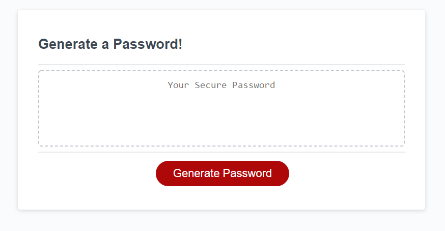

# Password-Security

Learning and adjusting to JS! 
* [Github Repository] (https://github.com/malhill/Password-Security)
* [Password App] (https://malhill.github.io/Password-Security/)

## Javascript
*Took acceptance criteria and placed it at the bottom to use as a reference. Then copied the peices to create the functions. 

*Understanding the process of creating variables, giving them a function, then calling the function!

*Used 'console.log' frequently to test function

*Completed most of the js code, most pieces in place, referenced other password generators. 

*Getting 'html...' posted and not knowing why? Console.log shows arrays are up but something is wrong in returning text. 

*Added a few returns to test if it was neccessary? Console.log everything!

*After using office hours I learned that I was using the 'return' function wrong/too much. Being too detailed I added too many 'statements' and in other cases needed to be specific in the 'functions' of the generator. 

*27(moving my pieces around) insertions 16 deletions(returns, and a few unnecessary lines) for my final edition of the homework
